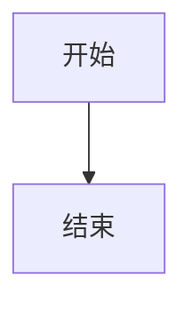

# Markdown to DOCX 转换工具

[](https://github.com/wangqiqi/md2docx/releases/tag/v0.5.53)
[](https://github.com/wangqiqi/cursor-ai-rules)

一个功能强大的 Markdown 转 DOCX 文档转换工具，支持丰富的 Markdown 语法，提供命令行和批量转换功能，能够生成格式精美的 DOCX 文档。

**✨ 新版本特性：**
- 🤖 集成 Cursor AI 协作规则系统 v3.0.0
- 🧠 智能项目感知和自动进化
- 🌍 多语言协作环境支持
- 📊 实时项目分析和优化建议

## 特性

- 支持标准 Markdown 语法
- 完整的格式转换（标题、列表、代码块、表格、引用、图片等）
- 批量转换功能
- 命令行接口
- 本地处理，保护隐私

## 已实现功能

- ✅ 标题转换（h1-h6）
- ✅ 段落和文本样式（粗体、斜体、删除线）
- ✅ 引用块（支持多层嵌套）
- ✅ 列表转换（有序列表、无序列表、多级嵌套）
- ✅ 代码块（支持语法高亮）
- ✅ 链接处理（内联链接、引用链接、URL自动链接）
- ✅ 图片支持（本地图片、在线图片）
- ✅ Mermaid 图表（graph / flowchart / sequence / gantt / state / class / pie）
- ✅ LaTeX 数学公式（`$…$` / `$$…$$`；块级自动编号 `(1)(2)…`；支持 `\label` / `\ref`）
- ✅ 表格转换（基础表格、对齐方式）
- ✅ 分隔线
- ✅ 任务列表（TODO列表）
- ✅ 基础 HTML 标签支持（复杂 HTML 块可选 `pip install mddocx[html]`，依赖 **html-for-docx**）
- ✅ Web界面 (Flask + HTML5 + CSS3)
- ✅ 实时预览功能
- ✅ 单文件上传和 DOCX 下载
- ✅ WebUI 多文件批量转换、阶段进度、ZIP 下载与逐文件错误摘要
- ✅ 响应式设计 (桌面/移动)
- ✅ 一次性阅读体验 (无页面滚动)
- ✅ 防抖优化和安全文件处理

## 质量保证

项目采用专业级的质量保证体系，确保代码可靠性和开发效率：

### 🧪 测试体系
- **321 测试用例**（`pytest -q`，随版本增长；以 CI 为准）— 覆盖核心功能、WebUI 和边界条件
- **持续集成覆盖率报告** - 多维度测试保证
- **大文件测试** - 支持1MB+文档处理
- **边界条件测试** - Unicode、嵌套、异常输入
- **Web界面测试** - 已纳入 CI 的完整用户界面功能验证

### 🔄 CI/CD 自动化
- **GitHub Actions** - 多Python版本测试 (3.8-3.12)
- **自动化检查** - 代码质量、格式、安全性
- **持续集成** - 每次提交自动验证

### 🛠️ 开发工具链
- **pre-commit** - 提交前代码质量检查
- **black + isort** - 自动代码格式化和导入排序
- **flake8** - 代码风格和错误检查
- **依赖分离** - 开发/生产环境独立配置

## 规划与路线图

📋 本地开发编排：`.cursorGrowth/plan.md`（**不入库**，jwplan/jwrun 自用）· 文档索引：[docs/README.md](docs/README.md)

**已完成 ✅:**
- ✅ 专业测试体系 (321 测试，覆盖率 ≥85%，CI 持续验证)
- ✅ CI/CD 自动化 (GitHub Actions 多版本测试)
- ✅ 代码质量保证 (pre-commit + 多工具检查)
- ✅ Web 界面、实时预览、响应式设计
- ✅ Mermaid 流程图、LaTeX 数学公式 (v0.5.x)
- ✅ html-for-docx 复杂 HTML 块 (v0.5.15+)
- ✅ 审查 ROI 闭合 · ConvertMetrics · mypy 收紧（v0.5.45–0.5.47）
- ✅ ConvertMetrics 性能基线与 CI 门禁（E-METRICS-01）
- ✅ html/mermaid 元素转换器热路径覆盖（E-COV-01）
- ✅ WebUI 批量转换、阶段进度与结构化错误摘要（P-WEBUI-01）

**规划中 📋:**
- 活路线图（产品 / 工程 backlog）：本地 **`.cursorGrowth/ROADMAP.md`**（**不入库**；clone 后由 `/learn`·`/plan` 维护）
- 产品候选：样式/模板 · 转换质量深挖

## 开发环境要求

- Python 3.8+
- python-docx
- markdown-it-py
- 其他依赖见 `pyproject.toml`

## 安装

### PyPI 安装（推荐）

直接从 PyPI 安装最新稳定版本：

```bash
pip install mddocx
```

**安装后即可使用完整功能：**
- 命令行工具：`mddocx`
- Web界面：`mddocx-webui`

### 开发环境安装

如果您要进行开发、测试或贡献代码：

1. 克隆仓库：
```bash
git clone [repository-url]
cd mddocx
```

2. 创建虚拟环境：
```bash
python -m venv venv
source venv/bin/activate  # Linux/Mac
# 或
venv\Scripts\activate  # Windows
```

3. 安装开发依赖：
```bash
pip install -e .[dev]
```

### 生产环境安装

```bash
pip install mddocx
```

从源码安装运行时依赖：

```bash
pip install .
```

### 依赖说明

- **`pyproject.toml`**：项目配置与依赖管理（唯一依赖源）
- **复杂 HTML**（Markdown 内嵌 `<table>` / `<div>` 等）：可选安装 `pip install mddocx[html]`，引入 [html-for-docx](https://pypi.org/project/html-for-docx/)（PyPI 包名 `html-for-docx`，import `html4docx`）。未安装时仍可用自研解析处理简单标签。
- **MCP（Cursor / Agent）**：可选安装 `pip install mddocx[mcp]`（**Python ≥3.10**），启动 `mddocx-mcp` 注册到 Cursor。示例配置见 [`examples/mcp-cursor.json`](examples/mcp-cursor.json)。工具：`convert_md_to_docx`（文本）、`convert_md_file_to_docx`（文件路径）。

## 使用方法

### MCP（Cursor Agent）

将 Markdown 转为 DOCX 供 Agent 调用（与 CLI 共用同一转换引擎）：

```bash
pip install mddocx[mcp]
```

在 Cursor 的 MCP 配置中加入（或合并 [`examples/mcp-cursor.json`](examples/mcp-cursor.json)）：

```json
{
  "mcpServers": {
    "mddocx": {
      "command": "mddocx-mcp",
      "args": []
    }
  }
}
```

| 工具 | 用途 |
|------|------|
| `convert_md_to_docx` | Markdown 字符串 → 指定 `output_path` |
| `convert_md_file_to_docx` | 磁盘上的 `.md` 文件 → DOCX（`output_path` 可省略） |

> Mermaid / LaTeX 块仍需访问 mermaid.ink、latex.codecogs.com。深度编辑已有 DOCX 请用专用 docx 工具，不要用本 MCP。


### Mermaid 流程图

在 Markdown 中使用 ` ```mermaid ` 代码块，支持 **graph** / **flowchart**、**sequenceDiagram**、**gantt**、**stateDiagram**、**classDiagram** 与 **pie**。转换时通过 [mermaid.ink](https://mermaid.ink) 渲染为 PNG 并嵌入 DOCX；渲染失败或不支持的图表类型会保留源码并附提示。

````markdown

````

> 需要网络访问 mermaid.ink；journey、ER 等未列类型将回退为源码。

### LaTeX 数学公式

支持行内 `$E=mc^2$` 与块级 `$$…$$`。转换时通过 [CodeCogs](https://www.codecogs.com/) 渲染为 PNG 并嵌入 DOCX；渲染失败则保留 LaTeX 源码并附提示。

```markdown
行内公式 $E=mc^2$ 示例。

块级公式自动编号，并可用 LaTeX 风格标签与引用：

```markdown
$$
E=mc^2 \label{eq:emc}
$$

见式 \ref{eq:emc}。
```

$$
\sum_{i=1}^n i = \frac{n(n+1)}{2}
$$
```

> 需要网络访问 latex.codecogs.com；复杂多行 `align` 环境等可能在首版回退为源码。

### Web界面 (推荐)

最简单的方式是使用内置的Web界面：

```bash
# 方法1：使用pip安装后运行（推荐）
mddocx-webui

# 方法2：使用命令行工具（推荐）
mddocx-webui

# 方法3：直接运行模块（源码运行）
python -m mddocx.webui.app

# 方法4：通过导入运行（源码运行）
python -c "from mddocx.webui.app import app; app.run(debug=True)"
```

启动后在浏览器中访问: `http://localhost:5000`

**Web界面特性：**
- 🎨 **一次性阅读体验**：页面无需滚动即可完整查看
- ⚡ **实时预览**：输入Markdown后立即预览DOCX效果（800ms防抖优化）
- 📁 **文件上传**：支持拖拽上传 .md、.markdown、.txt 文件
- 🔄 **智能预览**：自动生成DOCX样式预览，支持加载状态显示
- 🛡️ **安全处理**：严格的文件验证和内容检查，防止恶意文件
- 📱 **响应式设计**：完美支持桌面、平板、手机等各种设备
- ⌨️ **键盘快捷键**：
  - `Ctrl+Enter`: 提交转换
  - `Ctrl+Shift+P`: 切换预览面板
- 🌟 **现代化UI**：采用Material Design风格，交互流畅

**环境变量配置：**
```bash
# 生产环境
export FLASK_ENV=production
export SECRET_KEY=your-secret-key-here
export PORT=8000

# 开发环境（默认）
export FLASK_ENV=development
```

### 命令行工具

#### 单文件转换

```bash
mddocx input.md output.docx
```

#### 批量转换

```bash
python scripts/batch_convert.py --input-dir your_md_folder --output-dir your_docx_folder
```

## 项目结构

```
md2docx/
├── src/                    # 源代码目录
│   └── mddocx/            # Python包
│       ├── __init__.py    # 包初始化
│       ├── cli.py         # 命令行接口
│       ├── converter/     # 转换核心
│       │   ├── __init__.py
│       │   ├── base.py   # 基础转换类
│       │   └── elements/ # 各类元素转换器
│       │       ├── __init__.py
│       │       ├── base.py     # 基础元素转换器
│       │       ├── text.py     # 文本相关（段落、样式）
│       │       ├── heading.py  # 标题转换
│       │       ├── list.py     # 列表转换
│       │       ├── code.py     # 代码块转换
│       │       ├── table.py    # 表格转换
│       │       ├── image.py    # 图片转换
│       │       ├── links.py    # 链接转换
│       │       ├── blockquote.py # 引用块转换
│       │       ├── hr.py       # 分隔线转换
│       │       ├── task_list.py # 任务列表转换
│       │       └── html.py     # HTML标签转换
│       └── webui/         # 🆕 Web界面模块
│           ├── __init__.py
│           ├── app.py      # Flask应用主文件
│           ├── config.py   # 配置管理
│           ├── start_webui.py  # WebUI启动脚本
│           ├── templates/  # HTML模板
│           │   ├── base.html
│           │   ├── index.html
│           │   └── preview.html
│           ├── static/     # 静态文件
│           │   ├── css/
│           │   │   └── styles.css
│           │   ├── img/
│           │   └── js/
│           │       └── app.js
│           └── tests/      # WebUI测试
│               ├── __init__.py
│               └── test_basic.py
├── tests/                 # 测试用例
│   ├── __init__.py
│   ├── conftest.py       # 测试配置
│   ├── unit/            # 单元测试
│   │   ├── __init__.py
│   │   ├── test_edge_cases.py
│   │   └── test_elements/ # 元素测试
│   ├── integration/     # 集成测试
│   └── samples/         # 测试样例
│       ├── basic/       # 基础语法样例
│       └── advanced/    # 高级语法样例
├── docs/                # 01–07 阅读序，见 docs/README.md
├── scripts/             # 工具脚本目录
│   └── batch_convert.py         # 批量转换脚本
├── dist/                # 构建产物
├── pyproject.toml       # 项目配置和依赖管理
├── plan.md              # Sprint 编排（jwplan/jwrun）
├── MANIFEST.in          # 打包配置
├── .pre-commit-config.yaml  # pre-commit 配置
├── LICENSE              # 许可证
├── CHANGELOG.md         # 更新日志
└── README.md           # 项目说明
```

## 开发指南

请参考 [`docs/01_架构设计.md`](docs/01_架构设计.md) 了解详细的架构设计和开发规范。

## 测试

运行测试：
```bash
pytest tests/ src/mddocx/webui/tests/
```

发布候选预检（本地 `/release` 前推荐）：
```bash
bash scripts/verify_release_candidate.sh
```

## 贡献指南

1. Fork 项目
2. 创建特性分支
3. 提交变更
4. 推送到分支
5. 创建 Pull Request

## 发布说明

### 自动发布
项目使用 GitHub Actions 和 PyPI Trusted Publisher 实现自动发布：

```bash
# 推送版本标签触发自动发布
git tag v0.4.6
git push origin v0.4.6
```

### 手动发布
如果自动发布失败，可以使用手动发布脚本：

```bash
./scripts/publish_to_pypi.sh
```

### 配置 Trusted Publisher
在 PyPI 项目设置中添加：
- **Publisher**: GitHub
- **Repository**: wangqiqi/md2docx
- **Workflow**: publish.yml
- **Environment**: (留空)

## 贡献

欢迎贡献代码！请查看 [贡献指南](CONTRIBUTING.md) 了解详细信息。

## 许可证

MIT License
